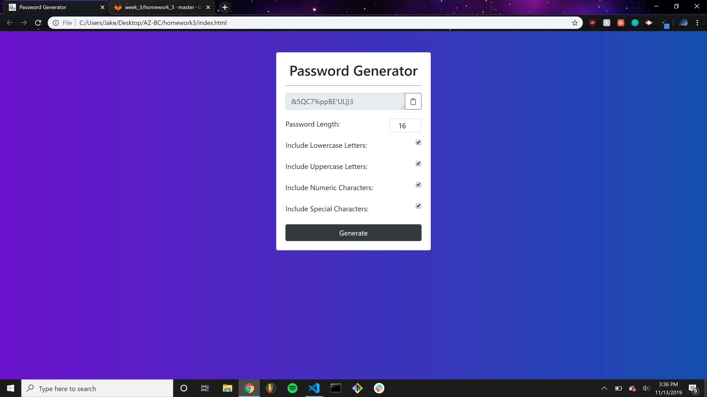

# Password Generator

This application allows you to ranomlg generate a password based on user-inputted specifications. The password can be anywhere from 8 to 128 characters long and can contain any or no mixture of lowercase, uppercase, numeric, and special characters. Once you get your password, you can click a button to copy it onto your clipboard, or you can click the Generate button again and get a different password.

